# Hi there, I'm HCFAlerts 👋

<div align="center">
  
[](https://github.com/HCFAlerts)

</div>

---

## 🚀 About Me

```java
public class HCFAlerts extends JavaPlugin {

    private static HCFAlerts instance;
    private String[] expertise = {"Java", "BungeeCord", "Spigot/Paper", "HCF Systems", "Redis/MongoDB"};
    private String[] specialties = {"Modular Architecture", "Performance Optimization", "Database Integration"};
    private String currentRole = "CEO & Lead Developer";
    
    @Override
    public void onEnable() {
        instance = this;
        
        getLogger().info("Loading HCFAlerts developer profile...");
        loadExpertise();
        initializeManagers();
        registerSkills();
        
        getLogger().info("Specialized in HCF (Hardcore Factions) development");
        getLogger().info("Building scalable solutions for 1000+ concurrent players");
        getLogger().info("Expert in modular plugin architecture & performance");
        getLogger().info("HCFAlerts profile successfully loaded!");
    }
    
    @Override
    public void onDisable() {
        getLogger().info("Saving all development progress...");
        getLogger().info("HCFAlerts profile disconnected, see you soon!");
    }
    
    private void loadExpertise() {
        registerExpertise("Java Backend Development", 100);
        registerExpertise("HCF Plugin Systems", 95); 
        registerExpertise("Database Architecture", 90);
        registerExpertise("Performance Optimization", 92);
    }
    
    private void initializeManagers() {
        new ArchitectureManager(this);
        new PerformanceManager(this); 
        new SecurityManager(this);
        getLogger().info("Core development managers initialized.");
    }
    
    public static HCFAlerts getInstance() {
        return instance;
    }
}
```

## 🏢 Organizations

<div align="center">
  
| Organization | Role | Focus |
|:---:|:---:|:---:|
| **[FlameClubDevelopment](https://github.com/FlameClubDevelopment)** | CEO & Founder | Enterprise Solutions |
| **[LiteClubDevelopment](https://github.com/LiteClubDevelopment)** | CEO & Founder | Lightweight Tools |
| **[NetSafe LLC](https://github.com/NetSafe-LLC)** | CEO & Founder | Network Security Solutions |

</div>

## 📊 GitHub Analytics

<div align="center">
  


</div>

<div align="center">
  
[](https://git.io/streak-stats)

</div>

## 🏆 GitHub Trophies

<div align="center">
  
[](https://github.com/ryo-ma/github-profile-trophy)

</div>

## 🛠️ Tech Stack

<div align="center">

### Core Technologies


### Development Tools


### Build & Database


### Minecraft Development


### Operating Systems


</div>

## 📈 Activity Graph

<div align="center">
  
[](https://github.com/HCFAlerts)

</div>

## 🎯 Current Focus

```mermaid
graph LR
    A[🎮 HCF Development] --> B[⚡ Performance Optimization]
    B --> C[🔧 Plugin Architecture]
    C --> D[📊 Data Management]
    D --> E[🛡️ Security & Fair Play]
    E --> A
```



## 💬 Connect With Me

<div align="center">
  
[](https://discord.com/users/1082095082573934672)

[](https://discord.gg/sU7D3KuJWp)

</div>

---

<div align="center">
  
### 💡 *"Code → Plugins → Better Servers"*


⭐ **If you find my work helpful, consider giving a star to my repositories!**

</div>

---

<div align="center">
  
</div>
